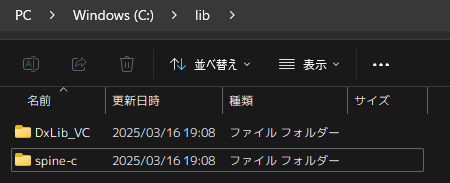

# spine-dxlib

## Overview (これはなに？)

[DX ライブラリへの Spine 組み込み #spine-c - Qiita](https://qiita.com/Ingaan/items/806e9dd6ad04f941a7df)を参考に DX ライブラリへ Spine を埋め込んだサンプルだよ。

元の記事より、もう少しだけ直感的にコードが記述できるように目指しました。
TypeScript 版 Spine ランタイムのような記述を意識しました。

## Requirement

### 開発環境

- Windows 10 以降の OS
- Visual Studio Community 2022 がまともに動く PC

### 動作環境

- Windows 10 以降の OS
- DirectX9 以降がインストールされていること
- 40MB ほどの空きメモリがあること

## Usage (つかいかた)

### クローン

```bash
git clone https://github.com/fluoroid/spine-dxlib.git
```

### DX ライブラリのダウンロード

DX ライブラリが初めての方は[DX ライブラリの使い方](https://dxlib.xsrv.jp/use/dxuse_vscom2022.html)を読もうね。

[DX ライブラリ公式ページ](https://dxlib.xsrv.jp/dxdload.html)

### Spine ランタイムのダウンロード

`spine-c`を使用しています。

EsotericSoftware/spine-runtimes/spine-c

[](https://github.com/EsotericSoftware/spine-runtimes/tree/4.2/spine-c)

### ライブラリを配置



`C:\lib\`下にダウンロードしたライブラリを格納します。
プロジェクトファイルの設定は以下のような設定になっておりますが、必要に応じて変更してください。

**追加のインクルード ディレクトリ**

```plaintext
C:\lib\DxLib_VC\プロジェクトに追加すべきファイル_VC用;
C:\lib\spine-c\include;
```

**追加のライブラリ ディレクトリ**

```plaintext
C:\lib\DxLib_VC\プロジェクトに追加すべきファイル_VC用;
```

また、コンパイルに必要な Spine ランタイムのソースコードが`C:\lib\spine-c\src\`を参照してプロジェクトに追加されています。
こちらも必要に応じて変更してください。

## Author

ふるおろいど (Fluoroid)

- [Misskey.io](https://misskey.io/@Fluoroid)
- [GitHub](https://github.com/fluoroid)

## Licenses

This software is released under the MIT license.

See [Licenses.md](/Licenses.md) for the license information on the libraries used in this project.
